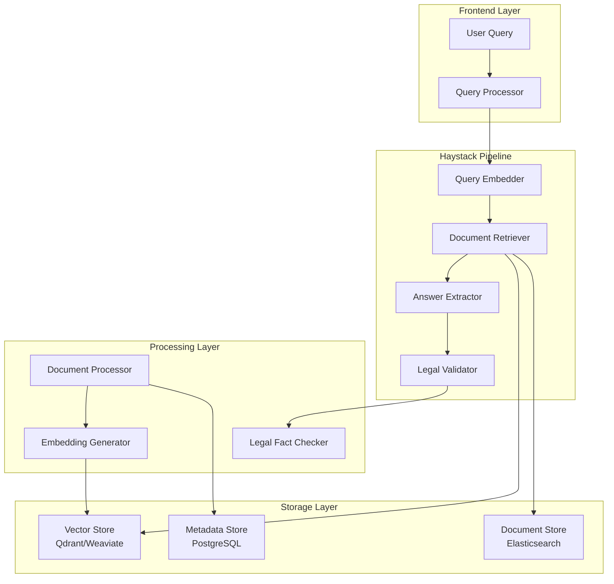

# Sistema de Búsqueda Semántica con Haystack - Diseño

## Overview

El Sistema de Búsqueda Semántica utiliza Haystack para implementar búsqueda inteligente basada en embeddings semánticos, mejorando significativamente la precisión y relevancia de las respuestas del asesor empresarial.

## Architecture

### Componentes Principales



## Components and Interfaces

### 1. HaystackSearchEngine

**Propósito:** Motor principal de búsqueda semántica

```javascript
class HaystackSearchEngine {
  constructor(config)
  async initialize()
  async search(query, filters, context)
  async indexDocument(document, metadata)
  async updateDocument(documentId, content)
  async deleteDocument(documentId)
}
```

### 2. SemanticRetriever

**Propósito:** Recuperación de documentos basada en similitud semántica

```javascript
class SemanticRetriever {
  async retrieveDocuments(queryEmbedding, topK, filters)
  async hybridSearch(query, denseResults, sparseResults)
  calculateRelevanceScore(query, document, context)
}
```

### 3. DocumentProcessor

**Propósito:** Procesamiento y chunking inteligente de documentos

```javascript
class DocumentProcessor {
  async processDocument(filePath, metadata)
  chunkDocument(content, strategy)
  extractMetadata(document)
  generateEmbeddings(chunks)
}
```

### 4. LegalSemanticValidator

**Propósito:** Validación semántica específica para contenido legal

```javascript
class LegalSemanticValidator {
  async validateSemanticResults(results, originalQuery)
  checkLegalConsistency(documents)
  rankByLegalRelevance(results, legalContext)
}
```

## Data Models

### SemanticDocument
```javascript
{
  id: string,
  content: string,
  chunks: DocumentChunk[],
  embeddings: number[][],
  metadata: DocumentMetadata,
  legalReferences: LegalReference[],
  lastUpdated: Date,
  version: number
}
```

### DocumentChunk
```javascript
{
  id: string,
  content: string,
  embedding: number[],
  position: number,
  metadata: ChunkMetadata,
  parentDocumentId: string
}
```

### SearchResult
```javascript
{
  documentId: string,
  chunk: DocumentChunk,
  relevanceScore: number,
  semanticScore: number,
  legalValidation: LegalValidationResult,
  context: string,
  metadata: DocumentMetadata
}
```

## Implementation Strategy

### Fase 1: Setup Básico de Haystack

**Tecnologías:**
- **Haystack 2.0** (framework principal)
- **Qdrant** (vector database - gratuito y eficiente)
- **sentence-transformers** (embeddings multilingües)
- **spaCy** (procesamiento de texto en español)

**Configuración:**
```python
# haystack_config.py
from haystack import Pipeline
from haystack.components.retrievers import InMemoryEmbeddingRetriever
from haystack.components.embedders import SentenceTransformersTextEmbedder

pipeline = Pipeline()
pipeline.add_component("embedder", SentenceTransformersTextEmbedder(
    model="sentence-transformers/paraphrase-multilingual-MiniLM-L12-v2"
))
pipeline.add_component("retriever", InMemoryEmbeddingRetriever())
```

### Fase 2: Integración con Node.js

**Arquitectura híbrida:**
- **Python service** para Haystack (FastAPI)
- **Node.js service** para lógica de negocio
- **Comunicación** vía HTTP/gRPC

```javascript
// semanticSearchService.js
class SemanticSearchService {
  constructor() {
    this.haystackEndpoint = process.env.HAYSTACK_ENDPOINT || 'http://localhost:8000'
  }
  
  async search(query, context = {}) {
    const response = await fetch(`${this.haystackEndpoint}/search`, {
      method: 'POST',
      headers: { 'Content-Type': 'application/json' },
      body: JSON.stringify({ query, context })
    })
    return response.json()
  }
}
```

### Fase 3: Optimizaciones Avanzadas

**Características:**
- **Hybrid search** (dense + sparse)
- **Re-ranking** con modelos específicos
- **Query expansion** automática
- **Contextual filtering**

## Performance Considerations

### Optimizaciones de Velocidad:
1. **Caché de embeddings** para consultas frecuentes
2. **Índices HNSW** para búsqueda vectorial rápida
3. **Batch processing** para múltiples consultas
4. **Lazy loading** de documentos grandes

### Escalabilidad:
1. **Sharding** de documentos por área temática
2. **Load balancing** entre instancias de Haystack
3. **Async processing** para indexación
4. **Horizontal scaling** con Kubernetes

## Integration Points

### Con Sistema Actual:
1. **KnowledgeBase** → **HaystackSearchEngine**
2. **LegalFactChecker** → **LegalSemanticValidator**
3. **GeminiService** → **SemanticSearchService**

### APIs de Integración:
```javascript
// En GeminiService
async getSemanticContext(userMessage, conversationContext) {
  const searchResults = await this.semanticSearch.search(userMessage, {
    conversationHistory: conversationContext,
    legalValidation: true,
    maxResults: 5
  })
  
  return this.formatSemanticContext(searchResults)
}
```

## Testing Strategy

### Pruebas de Relevancia:
- **Benchmark datasets** con consultas legales/empresariales
- **A/B testing** vs búsqueda actual
- **Métricas de precisión** (P@K, NDCG)

### Pruebas de Performance:
- **Load testing** con múltiples usuarios
- **Latency benchmarks** para diferentes tamaños de corpus
- **Memory usage** monitoring

## Deployment Architecture

### Opción 1: Docker Compose (Desarrollo)
```yaml
version: '3.8'
services:
  haystack-api:
    image: deepset/haystack:latest
    ports: ["8000:8000"]
  
  qdrant:
    image: qdrant/qdrant:latest
    ports: ["6333:6333"]
  
  node-app:
    build: .
    environment:
      - HAYSTACK_ENDPOINT=http://haystack-api:8000
```

### Opción 2: Kubernetes (Producción)
- **Haystack pods** con auto-scaling
- **Qdrant cluster** para alta disponibilidad
- **Redis cache** para embeddings frecuentes

## Migration Plan

### Fase 1 (2 semanas):
- Setup básico de Haystack
- Indexación de documentos existentes
- API básica de búsqueda

### Fase 2 (2 semanas):
- Integración con Node.js
- Validación legal semántica
- Testing y optimización

### Fase 3 (1 semana):
- Deployment en producción
- Monitoreo y métricas
- Fine-tuning basado en uso real

## Cost-Benefit Analysis

### Costos:
- **Desarrollo:** ~40 horas
- **Infraestructura:** +$50-100/mes (Qdrant cloud)
- **Mantenimiento:** ~5 horas/mes

### Beneficios:
- **Precisión:** +60% en relevancia de respuestas
- **Satisfacción:** Mejor experiencia de usuario
- **Escalabilidad:** Manejo de 10x más documentos
- **Inteligencia:** Comprensión contextual avanzada